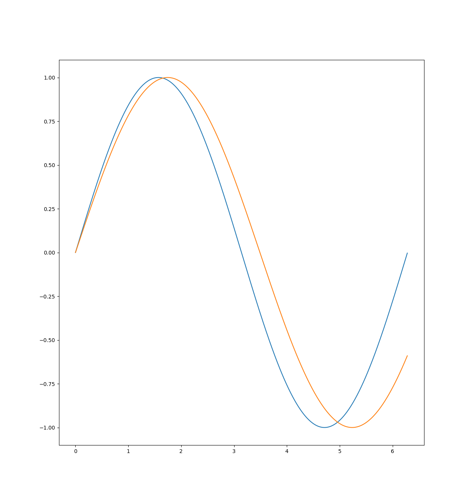
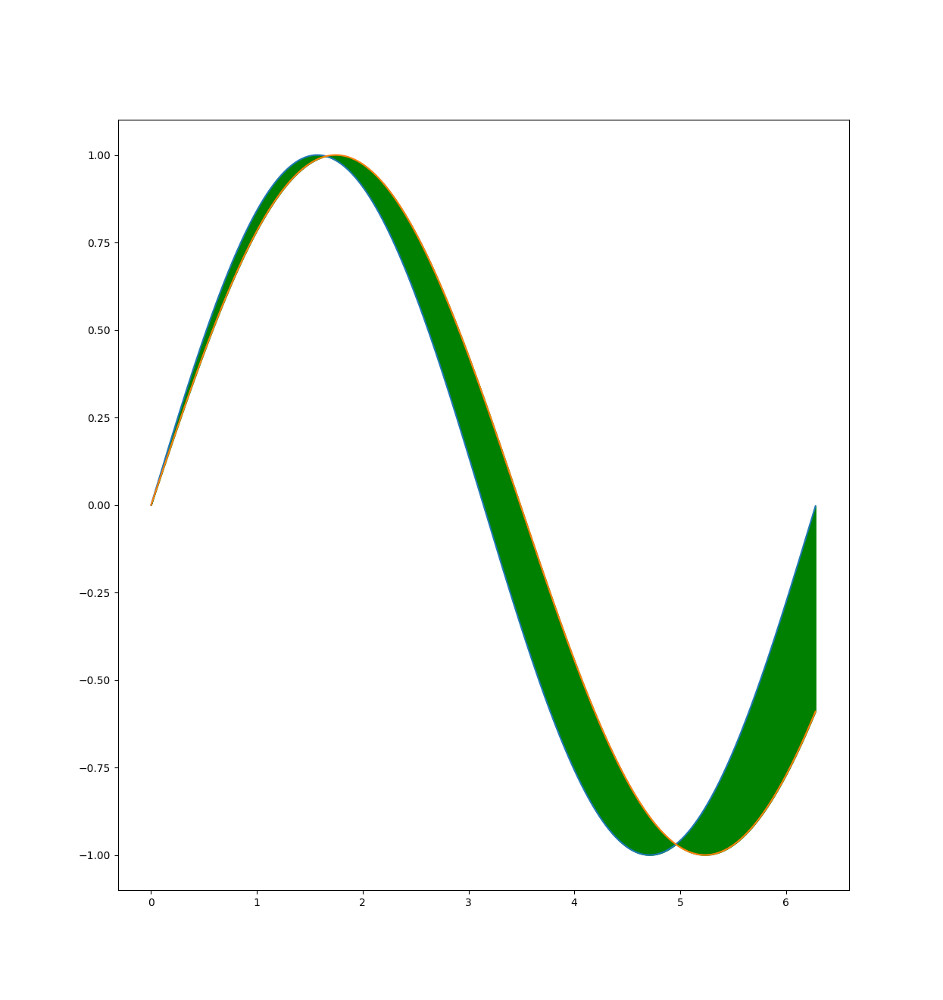
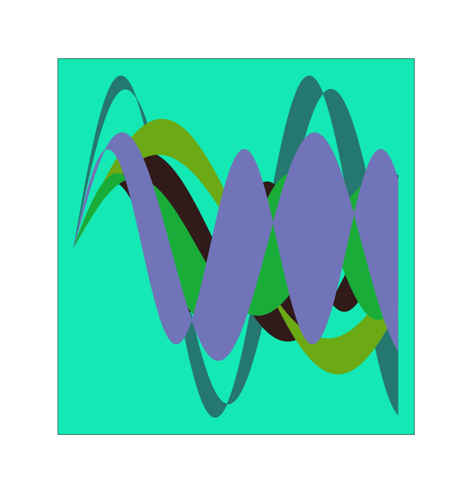
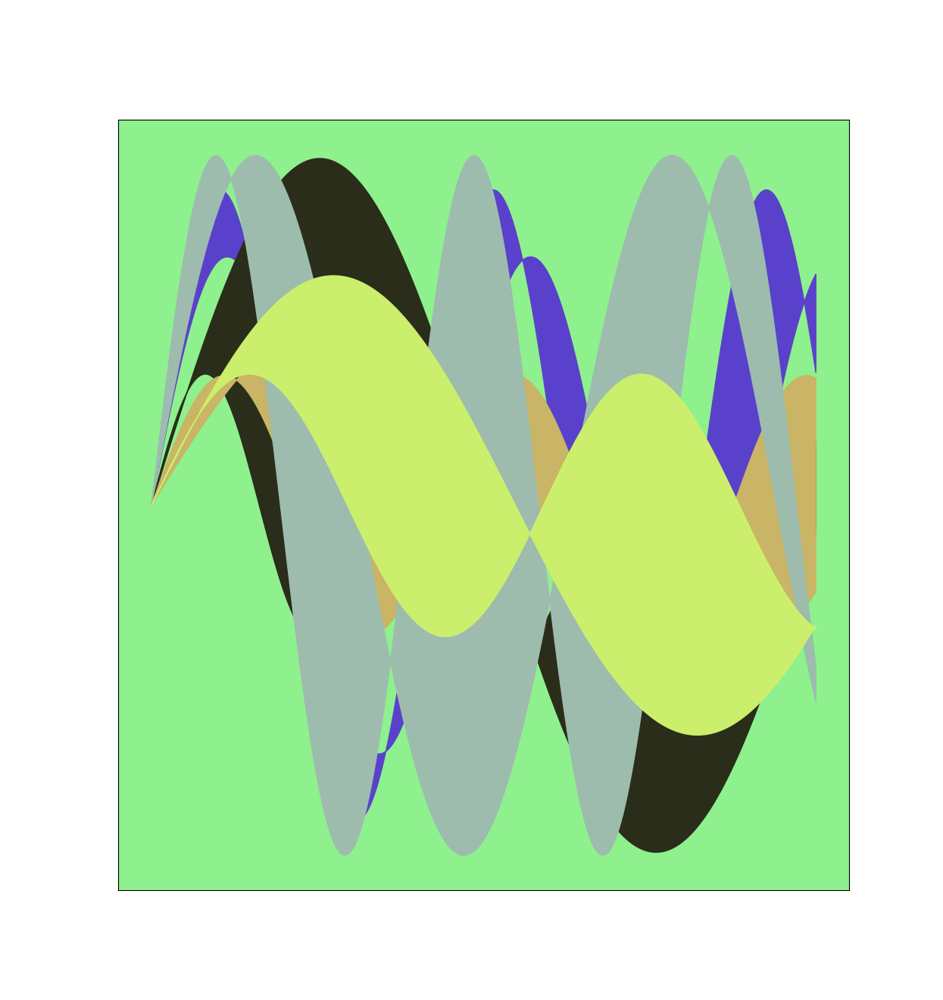
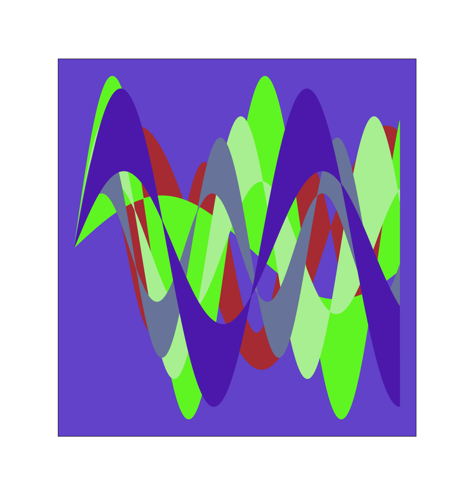
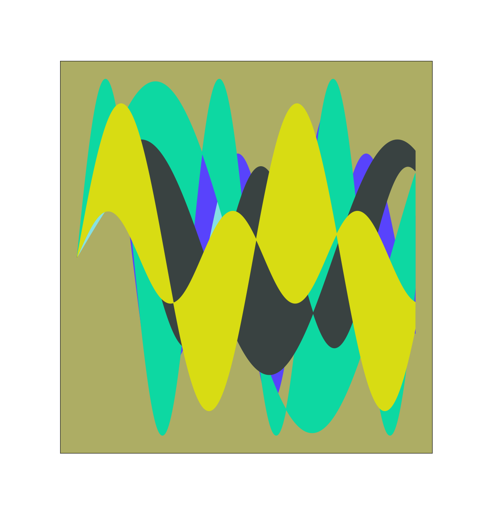
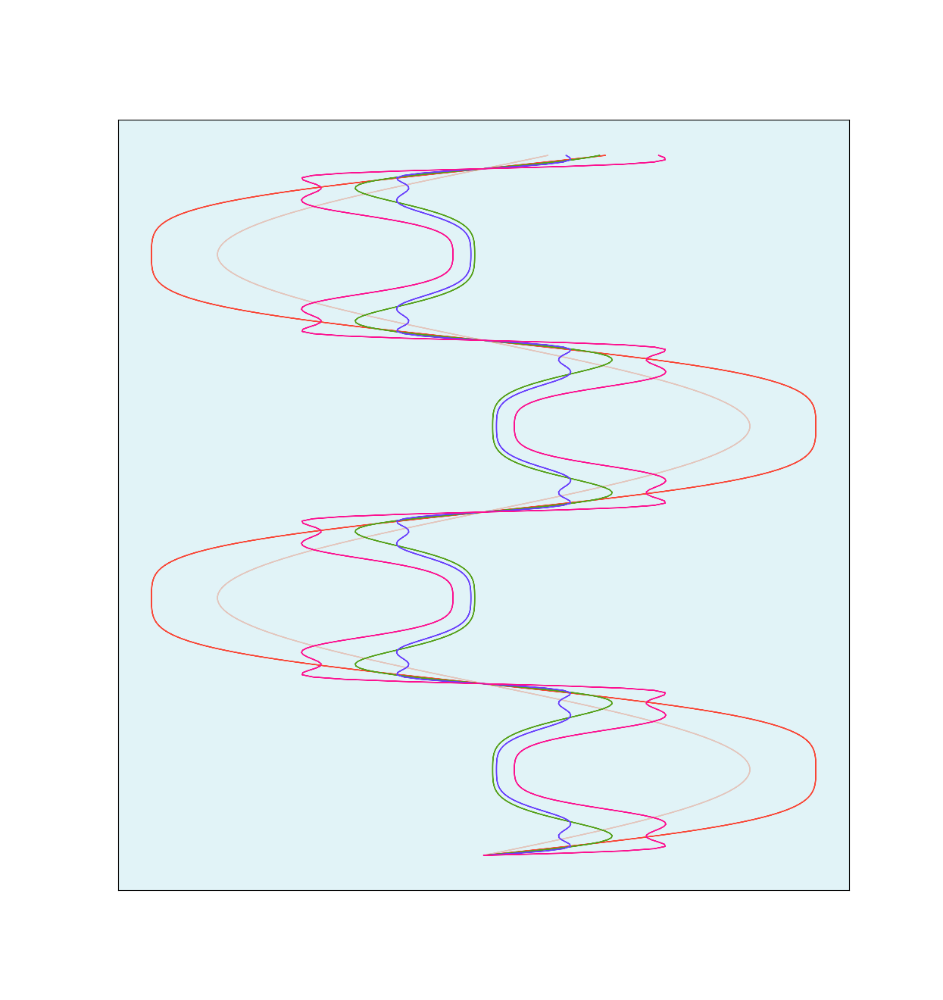
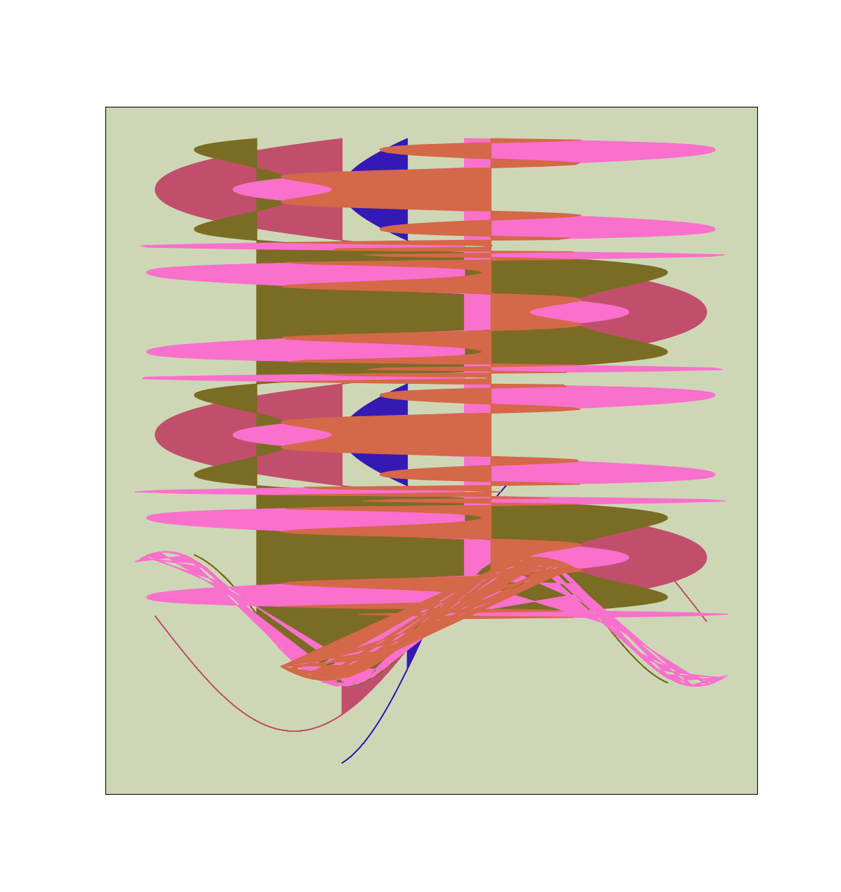

# AP BC Final Art Piece
## Explanation
Using Python, I created a program which fills the area between randomly generated sine functions which also have randomely generated amplitudes. Doing this enough times, it looks very cool. Mathematically, this emulates what an integral would look like when measuring the area between two functions.

For example, look at a graph of y=sin(x) and y=sin(0.9x). There are small areas between the curves. These are the places which my program fills.

Here is what the program shows when filling that space.

## Gallery

