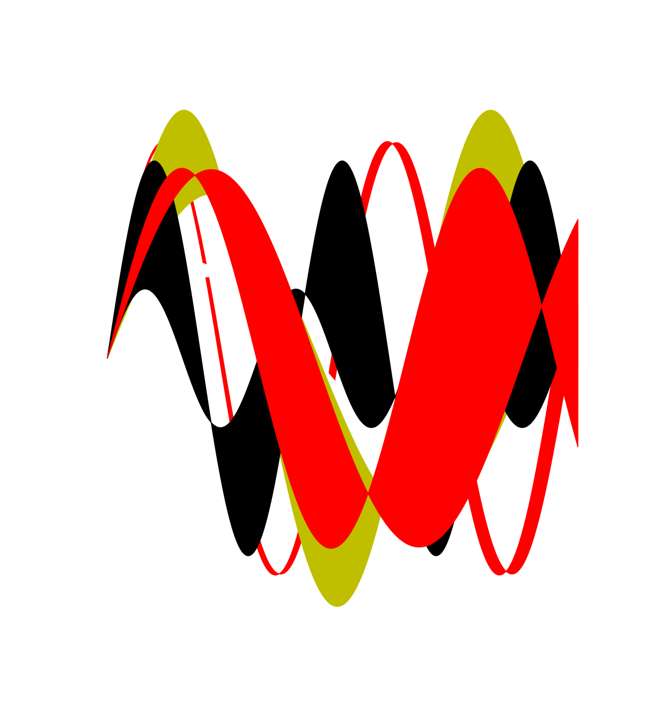

# AP BC Final Art Piece
## Explanation
Using Python, I created a program which graphs the area between randomly generated sine functions. This emulates what an integral would look like when measuring the area between two functions.

## Gallery

